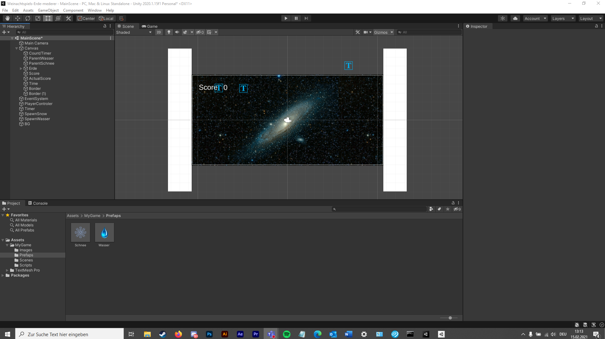

Weinachtsspiel-Erde-smederer

### Project description: 
recap projekt: C# basics, unity workflow 

### Development platform: 
Unity 1.15f1, visual studio 2019

### Target platform: 
Webgl (960 600)

### Visuals: 

 

### Necessary setup/execution steps: 
open projekt in Unity 1.15f1, press play button

### Third party material: 
Background image, Earth image, snow image, water image

### Project state: 
100%, finished. (MVP achieved)
MVP:
•	Aufsetzen des 2D Projekts screen-independent (960x600) mit git/GitHub
•	Player movement Horizontal 
•	Timer 1 Minute (mechanic & display)
•	Collectibles & Enemies spawnen & movement
•	Score mechanic: Collectibles, Player, Enemies Collisions & Trigger events 
•	Score display
•	PLUS: das gecodete in das Spiel visuell einzubauen (score ist während des Spielens sichtbar usw.)

### Limitations: 

### Lessons Learned: 
basics about c# scripting (movement, timer, random)

Copyright by smederer
